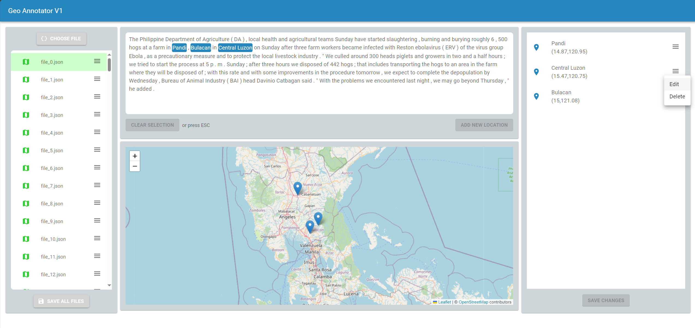

# Geo Annotator V1

## What is the Geo Annotator used for?
The Geo Annotator (GA) is used for managing annotated data, which has been parsed with a specific geoparser like CamCoder, Edinburgh Geoparser or more.



## Installation
To simply install all packages, run 
```bash 
npm install
```

If you manually want to install the packages, do the following:
- If you haven't Node.js already installed on your local system
```bash
conda create -n GeoAnnotator nodejs && conda activate GeoAnnotator
```
- React Material UI (MUI)
```bash
npm install @mui/material @mui/icons-material
```
- React Draggable (For draggable dialogs/popups)
```bash
npm install react-draggable
```
- Leaflet (Mapping)
```bash
npm install react-leaflet leaflet
```
- emotion.js (for custom react-components)
```bash
npm install @emotion/react @emotion/styled
```
- A custom font
```bash
npm install @fontsource/roboto
```
- Axios.js for recalling Request-API's in backend
```bash
npm install axios
```

## Usage
Choose a json-file, that contains a JSON-Array with JSON-Objects, each with following attributes:
- "locations": The locations, including their geolocations/coordinates (Latitude, Longitude)
- "text": Text content, from which the locations have been detected and extracted
- ...

Afterwards, the textcontent, with the highlighted locations, the mapping of each location and the locations themselfs will be shown on the page. 

## Project status
Still in development.