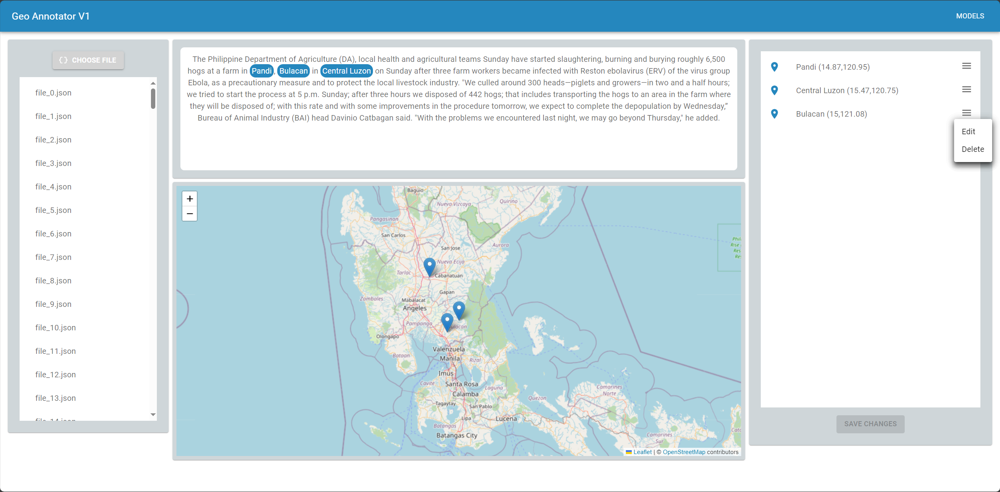

# Geo Annotator V1

## What is the Geo Annotator used for?
The Geo Annotator (GA) is used for managing annotated data, which has been parsed with a specific geoparser like CamCoder, Edinburgh Geoparser or more.

## Requirements
Thus the GA is powered with React, Node.js is required.

## Usage
Choose a json-file, that contains a JSON-Array with JSON-Objects, each with following attributes:
- "locations": The locations, including their geolocations/coordinates (Latitude, Longitude)
- "text": Text content, from which the locations have been detected and extracted
- ...

Afterwards, the textcontent, with the highlighted locations, the mapping of each location and the locations themselfs will be shown on the page. 

## Project status
Still in development.